# Machine Learning Notes

# Introduction
Tom Mitchell provides a more modern definition of Machine Learning:
> *"A computer program is said to learn from **experience E** with respect to some class of **tasks T** and **performance measure P**, if its performance at tasks in T, as measured by P, improves with experience E."*

In general, any machine learning problem can be assigned to one of two broad classifications:
-   Supervised learning 
-   Unsupervised learning.

## Supervised Learning
In supervised learning, we are given a data set and already know what our correct output should look like, having the idea that there is a relationship between the input and the output. Supervised learning problems are categorized into:
-   **Regression problem**: In a regression problem, we are trying to predict results within a continuous output, meaning that we are trying to map input variables to some continuous function.
-   **Classification problem**: In a classification problem, we are instead trying to predict results in a discrete output. In other words, we are trying to map input variables into discrete categories.
#### Examples:
-   **Regression**: Given a picture of a person, we have to predict their age on the basis of the given picture.
-   **Classification**: Given a patient with a tumor, we have to predict whether the tumor is malignant or benign.


## Unsupervised Learning
Unsupervised learning allows us to approach problems with little or no idea what our results should look like. We can derive structure from data where we don't necessarily know the effect of the variables.

We can derive this structure by **clustering** the data based on relationships among the variables in the data.

With unsupervised learning there is no feedback based on the prediction results.
#### Examples: 
-   **Clustering**: Take a collection of 1,000,000 different genes, and find a way to automatically group these genes into groups that are somehow similar or related by different variables, such as lifespan, location, roles, and so on.
-   **Non-clustering**: The "Cocktail Party Algorithm", allows you to find structure in a chaotic environment. (i.e. identifying individual voices and music from a mesh of sounds at a cocktail party).

## Model Representation
To establish notation for future use, we’ll use $x^{(i)}$
to denote the “input” variables, also called input features, and $y^{(i)}$ to denote the “output” or target variable that we are trying to predict. A pair $(x^{(i)} , y^{(i)} )$ is called a **training example**, and the dataset that we’ll be using to learn - a list of $m$ training examples $(x(i),y(i));i=1,...,m$ - is called a **training set**. Note that the superscript “$(i)$” in the notation is simply an index into the training set, and has nothing to do with exponentiation. We will also use X to denote the space of input values, and Y to denote the space of output values. In this example, $X = Y = ℝ.$

To describe the supervised learning problem slightly more formally, our goal is, given a training set, to learn a function $h : X → Y$ so that $h(x)$ is a “good” predictor for the corresponding value of $y$. 

## Cost Function
We can measure the accuracy of our hypothesis function by using a **cost function**. This takes an average difference of all the results of the hypothesis with inputs from $x$'s and the actual output $y$'s.

$$J(\theta_0,\theta_1) = \frac{1}{2m}\sum_{i=1}^m(h_\theta(x_i)-y_i)^2$$

To break it apart, it is $\frac{1}{2}\bar{x}$ where $\bar{x}$ is the mean of the squares of $h_\theta (x_{i}) - y_{i}$, or the difference between the predicted value and the actual value.

This function is otherwise called the "**Squared error function**", or "**Mean squared error**". The mean is halved $\left(\frac{1}{2}\right)$ as a convenience for the computation of the gradient descent, as the derivative term of the square function will cancel out the $\frac{1}{2}$ term.

If we try to think of it in visual terms, our training data set is scattered on the $x$ - $y$ plane. We are trying to make a straight line (defined by $h_\theta(x)$ ) which passes through these scattered data points.

Our objective is to get the best possible line. The best possible line will be such so that the average squared vertical distances of the scattered points from the line will be the least. Ideally, the line should pass through all the points of our training data set. In such a case, the value of $J(\theta_0, \theta_1)$ will be 0.

## Gradient Descent 
So we have our hypothesis function and we have a way of measuring how well it fits into the data. Now we need to estimate the parameters in the hypothesis function. That's where gradient descent comes in.

Imagine that we graph our hypothesis function based on its fields $\theta_0$ and $\theta_1$ (actually we are graphing the cost function as a function of the parameter estimates). We are not graphing $x$ and $y$ itself, but the parameter range of our hypothesis function and the cost resulting from selecting a particular set of parameters. We put $\theta_0$ on the $x$ axis and $\theta_1$ on the $y$ axis, with the cost function on the vertical $z$ axis. The points on our graph will be the result of the cost function using our hypothesis with those specific theta parameters. The graph below depicts such a setup:

 

We will know that we have succeeded when our cost function is at the very bottom of the pits in our graph, i.e. when its value is the minimum. The red arrows show the minimum points in the graph.

The way we do this is by taking the derivative (the tangential line to a function) of our cost function. The slope of the tangent is the derivative at that point and it will give us a direction to move towards. We make steps down the cost function in the direction with the steepest descent. The size of each step is determined by the parameter $\alpha$, which is called the **learning rate**.

For example, the distance between each 'star' in the graph above represents a step determined by our parameter $\alpha$. A smaller $\alpha$ would result in a smaller step and a larger $\alpha$ results in a larger step. The direction in which the step is taken is determined by the partial derivative of $J(\theta_0,\theta_1)$. Depending on where one starts on the graph, one could end up at different points. The image above shows us two different starting points that end up in two different places. The **gradient descent algorithm** is:

*Repeat until convergence:*

$$\theta_j := \theta_j -\alpha\frac{∂}{∂\theta_j}J(\theta_0, \theta_1)$$

*where $j, i$ represents the feature index number*.

At each iteration $j$, one should simultaneously update the parameters $\theta_0, \theta_1, ..., \theta_n$. 
Updating a specific parameter prior to calculating another one on the $j^{(th)}$ iteration would yield to a wrong implementation.

On a side note, we should adjust our parameter $\alpha$ to ensure that the gradient descent algorithm converges in a reasonable time. Failure to converge or too much time to obtain the minimum value imply that our step size is wrong. But, how does gradient descent converge with a fixed step size $\alpha$?

The intuition behind the convergence is that $\frac{d}{d\theta_1} J(\theta_1)$ approaches $0$ as we approach the bottom of our convex function. At the minimum, the derivative will always be $0$ and thus we get:

$$\theta_1 := \theta_1-\alpha*0$$

This means gradient descent can converge to a local minimum, even with the **learning rate **$\alpha$** fixed**. As we approach a local minimum, gradient descent will automatically take smaller steps. So, no need to decrease $\alpha$ over time.

## Gradient Descent For Linear Regression
When specifically applied to the case of linear regression, a new form of the gradient descent equation can be derived. We can substitute our actual cost function and our actual hypothesis function and modify the equation to :

*Repeat until convergence: {*

$$\theta_0 := \theta_0 -\alpha\frac{1}{m}\sum_{i=1}^m(h_\theta(x_i)-y_i)$$

$$\theta_1 := \theta_1 -\alpha\frac{1}{m}\sum_{i=1}^m(h_\theta(x_i)-y_i) x_i$$

*} where $m$ is the size of the training set, $\theta_0$ a constant that will be changing simultaneously with $\theta_1$ and $x_{i}, y_{i}$ are values of the given training set (data)*.

The point of all this is that if we start with a guess for our hypothesis and then repeatedly apply these gradient descent equations, our hypothesis will become more and more accurate. So, this is simply gradient descent on the original cost function $J$. This method looks at every example in the entire training set on every step, and is called **batch gradient descent**. Note that, while gradient descent can be susceptible to local minima in general, the optimization problem we have posed here for linear regression has only one global, and no other local, optima; thus gradient descent always converges (assuming the learning rate $\alpha$ is not too large) to the global minimum. Indeed, $J$ is a convex quadratic function. Here is an example of gradient descent as it is run to minimize a quadratic function:

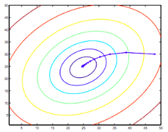

The ellipses shown above are the contours of a quadratic function. Also shown is the trajectory taken by gradient descent, which was initialized at $(48,30)$. The $x$’s in the figure (joined by straight lines) mark the successive values of $\theta$ that gradient descent went through as it converged to its minimum.

## Matrix Operations

### Matrix Vector Moltiplication

We map the column of the vector onto each row of the matrix, multiplying each element and summing the result.

$$\begin{pmatrix}a & b\\\ c & d\\e & f\end{pmatrix}*\begin{pmatrix}x \\ y\end{pmatrix}=\begin{pmatrix}a*x+b*y\\c*x+d*y\\e*x+f*y\end{pmatrix}$$

The result is a vector. The **number of columns** of the **matrix** must **equal the number of rows of the vector**.
An $m$ x $n$ matrix multiplied by an $n$ x $1$ vector results in an $m$ x $1$ vector.

### Matrix Matrix Moltiplication
We multiply two matrices by breaking it into several vector multiplications and concatenating the result.
$$\begin{pmatrix}a & b\\\ c & d\\e & f\end{pmatrix}*\begin{pmatrix}w & x\\ y & z\end{pmatrix}=\begin{pmatrix}a*w+b*y & a*x+b*z\\c*w+d*y & c*x+d*z\\e*w+f*y & e*x+f*z\end{pmatrix}$$

An $m$ x $n$ matrix multiplied by an $n$ x $o$ matrix results in an $m$ x $o$ matrix. In the above example, a $3$ x $2$ matrix times a $2$ x $2$ matrix resulted in a $3$ x $2$ matrix.

To multiply two matrices, the **number of columns of the first matrix** must **equal** the **number of rows of the second matrix**.

# Multivariate Linear Regression

## Multiple Features
Linear regression with multiple variables is also known as "multivariate linear regression".

We now introduce notation for equations where we can have any number of input variables.

$x^{(i)}_j=$ value of feature $j$ in the $i^{th}$ training example.

$x^{(i)} =$ the input (features) of the $i^{th}$ training example.

$m=$ the number of training examples.

$n=$ the number of features.

The multivariable form of the hypothesis function accommodating these multiple features is as follows:

$$h_\theta(x)=\theta_0+\theta_1x_1+\theta_2x_2+...+\theta_nx_n$$

In order to develop intuition about this function, we can think about $\theta_0$ as the basic price of a house, $\theta_1$ as the price per square meter, $\theta_2$ as the price per floor, etc. $x_1$ will be the number of square meters in the house, $x_2$ the number of floors, etc.

Using the definition of matrix multiplication, our multivariable hypothesis function can be concisely represented as:

$$h_\theta(x)=\begin{pmatrix} \theta_0 & \theta_1 & ... & \theta_n \end{pmatrix}\begin{pmatrix}x_0 \\ x_1\\...\\x_n\end{pmatrix}= \theta^Tx$$

This is a vectorization of our hypothesis function for one training example. *Remark*: Note that for convenience reasons in this course we assume $x_{0}^{(i)} =1$ $\text{ for } (i\in { 1,\dots, m } )$. This allows us to do matrix operations with theta and x.

## Gradient Descent For Multiple Variables
The gradient descent equation itself is generally the same form; we just have to repeat it for our 'n' features:

*repeat until convergence:* {
$$\theta_j:=\theta_j-\alpha\frac{1}{m}\sum_{i=1}^m(h_\theta(x^{(i)})-y^{(i)})⋅x_j^{(i)}\text{ for j:= 0 ... n}$$
}

The following image compares gradient descent with one variable to gradient descent with multiple variables:


## Gradient Descent Practice - Feature Scaling

We can speed up gradient descent by having each of our input values in roughly the same range. This is because θ will descend quickly on small ranges and slowly on large ranges, and so will oscillate inefficiently down to the optimum when the variables are very uneven.

The way to prevent this is to modify the ranges of our input variables so that they are all roughly the same. Ideally:

$$-1 <=x_{(i)}<= 1$$

or

$$-0.5<=x_{(i)}<=0.5$$ 
These aren't exact requirements; we are only trying to speed things up. The goal is to get all input variables into roughly one of these ranges, give or take a few.

Two techniques to help with this are **feature scaling** and **mean normalization**. Feature scaling involves dividing the input values by the range (i.e. the maximum value minus the minimum value) of the input variable, resulting in a new range of just $1$. Mean normalization involves subtracting the average value for an input variable from the values for that input variable resulting in a new average value for the input variable of just zero. To implement both of these techniques, adjust your input values as shown in this formula:

$$x_i:=\frac{x_i-\mu_i}{s_i}$$

Where $μ_i$ is the average of all the values for feature (i) and $s_i$ is the range of values $(max - min)$, or $s_i$ is the **standard deviation**.

*Note:* dividing by the range, or dividing by the standard deviation, give different results. The quizzes in this course use range - the programming exercises use standard deviation.

## Gradient Descent Practice - Learning Rate
**Debugging gradient descent**. Make a plot with number of iterations on the x-axis. Now plot the cost function, $J(θ)$ over the number of iterations of gradient descent. If $J(θ)$ ever increases, then you probably need to decrease $α$.

**Automatic convergence test**. Declare convergence if $J(θ)$ decreases by less than $E$ in one iteration, where $E$ is some small value such as $10^{−3}$. However in practice it's difficult to choose this threshold value.

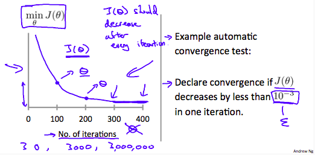

It has been proven that if learning rate α is sufficiently small, then J(θ) will decrease on every iteration.
To summarize:

*   If $\alpha$ is too small: slow convergence.
*   If $\alpha$ is too large: may not decrease on every iteration and thus may not converge.

## Features and Polynomial Regression
We can improve our features and the form of our hypothesis function in a couple different ways. 
We can **combine** multiple features into one. For example, we can combine $x_1$ and $x_2$ into a new feature $x_3$ by taking $x_1⋅x_2$.

### Polynomial Regression
Our hypothesis function need not be linear (a straight line) if that does not fit the data well.

We can **change the behavior or curve** of our hypothesis function by making it a quadratic, cubic or square root function (or any other form).

For example, if our hypothesis function is $h_\theta(x)=\theta_0+\theta_1x_1$ then we can create additional features based on $x_1$, to get the quadratic function $h_\theta(x)=\theta_0+\theta_1x_1+\theta_2x_1^2$ or the cubic function $h_\theta(x)=\theta_0+\theta_1x_1+\theta_2x_1^2+\theta_3x_1^3$.

*One important thing to keep in mind is, if you choose your features this way then feature scaling becomes very important.*

## Computing Parameters Analytically

### Normal Equation
Gradient descent gives one way of minimizing $J$. Let’s discuss a second way of doing so, this time performing the minimization explicitly and without resorting to an iterative algorithm. In the "Normal Equation" method, we will minimize $J$ by explicitly taking its derivatives with respect to the θj ’s, and setting them to zero. This allows us to find the optimum theta without iteration. The normal equation formula is given below:
$$\theta=(X^TX)^{-1}X^Ty$$

There is **no need** to do feature scaling with the normal equation.
The following is a comparison of gradient descent and the normal equation:

| Gradient Descent | Normal Equation 
|---|---
| Need to choose alpha  | No need to choose alpha  
| Needs many iterations  | No need to iterate
| $\mathcal{O}(kn^2)$| $\mathcal{O}(n^3)$ need to calculate inverse of $X^TX$    
| Works well when $n$ is large | Slow if $n$ is very large   

With the normal equation, computing the inversion has complexity $\mathcal{O}(n^3)$. So if we have a very large number of features, the normal equation will be slow. In practice, when $n$ exceeds $10,000$ it might be a good time to go from a normal solution to an iterative process.

# Classification
To attempt classification, one method is to use linear regression and map all predictions greater than $0.5$ as a $1$ and all less than $0.5$ as a $0$. However, this method doesn't work well because classification is not actually a linear function.

The classification problem is just like the regression problem, except that the values we now want to predict take on only a small number of discrete values. For now, we will focus on the **binary classification problem** in which $y$ can take on only two values, $0$ and $1$. (Most of what we say here will also generalize to the multiple-class case.) For instance, if we are trying to build a spam classifier for email, then $x^{(i)}$ may be some features of a piece of email, and $y$ may be $1$ if it is a piece of spam mail, and $0$ otherwise. Hence, $y∈{0,1}.$ $0$ is also called the **negative class**, and $1$ the **positive class**, and they are sometimes also denoted by the symbols “-” and “+.” Given $x^{(i)}$, the corresponding $y^{(i)}$ is also called the label for the training example.

## Hypotesis Representation - Logistic Function
We could approach the classification problem ignoring the fact that $y$ is discrete-valued, and use our old linear regression algorithm to try to predict $y$ given $x$. However, it is easy to construct examples where this method performs very poorly. Intuitively, it also doesn’t make sense for $h_\theta (x)$ to take values larger than $1$ or smaller than $0$ when we know that $y ∈ {0, 1}$. To fix this, let’s change the form for our hypotheses $h_\theta (x)$ to satisfy $0 \leq h_\theta (x) \leq 1$. This is accomplished by plugging $\theta^Tx$ into the Logistic Function. Our new form uses the "Sigmoid Function," also called the "**Logistic Function**":

$$h_\theta(x)=g(\theta^Tx)$$
$$z = \theta^Tx$$
$$g(z)=\frac{1}{1+e^{-z}}$$
The following image shows us what the sigmoid function looks like:


The function $g(z)$, shown here, maps any real number to the $(0, 1)$ interval, making it useful for transforming an arbitrary-valued function into a function better suited for classification.

$h_\theta(x)$ will give us the **probability** that our output is $1$. For example, $h_\theta(x)=0.7$ gives us a probability of 70% that our output is $1$. Our probability that our prediction is $0$ is just the complement of our probability that it is $1$ (e.g. if probability that it is $1$ is 70%, then the probability that it is $0$ is 30%).

$$h_\theta(x)=P(y=1| x;\theta)=1-P(y=0|x; \theta)$$
$$P(y=0|x; \theta)+P(y=1|x; \theta)=1$$

## Decision Boundary
In order to get our discrete $0$ or $1$ classification, we can translate the output of the hypothesis function as follows:
$$h_\theta(x) \geq 0.5 → y=1$$
$$h_\theta(x) < 0.5 → y=0$$

The way our logistic function $g$ behaves is that when its input is greater than or equal to zero, its output is greater than or equal to $0.5$:
$$g(z)\geq0.5 \text{ when }z\geq0$$
So if our input to $g$ is $\theta^T X$, then that means:
$$hθ(x)=g(θTx)≥0.5\text{ when }θ^Tx \geq0$$
From these statements we can now say:
$$θ^Tx≥0⇒y=1$$
$$θ^Tx<0⇒y=0$$
The **decision boundary** is the line that separates the area where $y = 0$ and where $y = 1$. It is created by our hypothesis function.

## Cost Function 
We cannot use the same cost function that we use for linear regression because the Logistic Function will cause the output to be wavy, causing many local optima. In other words, it will not be a convex function.
Instead, our cost function for logistic regression looks like:
$$J(θ)=∑_{i=1}^mCost\bigg(h_θ(x(i)),y(i)\biggr)$$
$$Cost\bigg(h_θ(x),y\biggr)=−log(hθ(x))\text{ if y = 1 }$$
$$Cost\bigg(h_θ(x),y\biggr)=−log(1−hθ(x))\text{ if y = 0 }$$

When $y = 1$, we get the following plot for $J(\theta)$ vs $h_\theta (x)$:

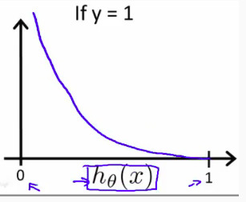

Similarly, when y = 0, we get the following plot for $J(\theta)$ vs $h_\theta (x)$:

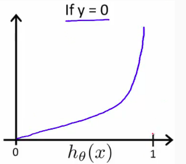

$$Cost(hθ(x),y)=0 \text{ if } hθ(x)=y$$
$$Cost(hθ(x),y)→∞ \text{ if } y=0 \text{ and }hθ(x)→1$$
$$Cost(hθ(x),y)→∞ \text{ if } y=1 \text{ and } hθ(x)→0$$

If our correct answer 'y' is 0, then the cost function will be 0 if our hypothesis function also outputs 0. If our hypothesis approaches 1, then the cost function will approach infinity.

If our correct answer 'y' is 1, then the cost function will be 0 if our hypothesis function outputs 1. If our hypothesis approaches 0, then the cost function will approach infinity.

*Note* that writing the cost function in this way guarantees that J(θ) is convex for logistic regression.

## Simplified Cost Function and Gradient Descent
We can compress our cost function's two conditional cases into one case:
$$Cost(h_θ(x),y)=−ylog(h_θ(x))−(1−y)⋅log(1−h_θ(x))$$

Notice that when y is equal to $1$, then the second term $(1-y)\log(1-h_\theta(x))$ will be zero and will not affect the result. If y is equal to $0$, then the first term $-y \log(h_\theta(x))$ will be zero and will not affect the result.

We can fully write out our entire cost function as follows:
$$J(\theta)=-\frac{1}{m}\sum_{i=1}^m\bigg[y^{(i)}log(h_\theta(x^{(i)}))+(1-y^{(i)})⋅log(1-h_\theta(x^{(i)}))\biggr]$$

A **vectorized implementation** is:
$$h=g(X\theta)$$
$$J(\theta)=\frac{1}{m}⋅\bigg(-y^Tlog(h)-(1-y)^Tlog(1-h)\biggr)$$

### Gradient Descent
*Repeat* {
$$\theta_j:=\theta_j-\frac{\alpha}{m}\sum_{i=1}^m(h_\theta(x)^{(i)}-y^{(i)}x_j^{(i)})$$
}

*Notice* that this algorithm is identical to the one we used in linear regression. We still have to simultaneously update all values in theta.

A **vectorized implementation** is:
$$\theta:=\theta-\frac{\alpha}{m}X^T(g(X\theta)-\vec{y}$$

## Advanced Optimization
"Conjugate gradient", "BFGS", and "L-BFGS" are more sophisticated, faster ways to optimize $θ$ that can be used instead of gradient descent. We suggest that you should not write these more sophisticated algorithms yourself (unless you are an expert in numerical computing) but use the libraries instead, as they're already tested and highly optimized. Octave provides them.

We first need to provide a function that evaluates the following two functions for a given input value $θ$:
$$J(\theta)$$
$$\frac{∂}{∂\theta_j}J(\theta)$$
We can write a single function that returns both of these:

```
function [jVal, gradient] = costFunction(theta)
  jVal = [...code to compute J(theta)...];
  gradient = [...code to compute derivative of J(theta)...];
end
```
Then we can use octave's *"fminunc()"* optimization algorithm along with the *"optimset()"* function that creates an object containing the options we want to send to *"fminunc()"*.
```
options = optimset('GradObj', 'on', 'MaxIter', 100);
initialTheta = zeros(2,1);
   [optTheta, functionVal, exitFlag] = fminunc(@costFunction, initialTheta, options);
```
We give to the function "fminunc()" our cost function, our initial vector of theta values, and the "options" object that we created beforehand.

## Multiclass Classification: One-vs-all
Now we will approach the classification of data when we have more than two categories. Instead of $y = {0,1}$ we will expand our definition so that $y = {0,1...n}$.

Since $y = {0,1...n}$, we divide our problem into $n+1$ (+1 because the index starts at 0) binary classification problems; in each one, we predict the probability that 'y' is a member of one of our classes.
$$y∈{0,1...n}$$
$$h^{(0)}_θ(x)=P(y=0|x;θ)$$
$$h^{(1)}_θ(x)=P(y=1|x;θ)$$
$$⋯$$
$$h^{(n)}_θ(x)=P(y=n|x;θ)$$
$$\text{prediction}={max}_{i}(h^{(i)}_θ(x))$$
We are basically choosing one class and then lumping all the others into a single second class. We do this repeatedly, applying binary logistic regression to each case, and then use the hypothesis that returned the highest value as our prediction.

The following image shows how one could classify 3 classes:


**To summarize:**
Train a logistic regression classifier $h_\theta(x)$ for each class to predict the probability that  $y = i$.

To make a prediction on a new x, pick the class that maximizes $h_\theta (x)$.

## Overfitting problem
Consider the problem of predicting $y$ from $x ∈ R$. The leftmost figure below shows the result of fitting a $y = θ_0 + θ_1xθ$ to a dataset. We see that the data doesn’t really lie on straight line, and so the fit is not very good.


Instead, if we had added an extra feature $x^2$, and fit $y = \theta_0 + \theta_1x + \theta_2x^2$, then we obtain a slightly better fit to the data (See middle figure). Naively, it might seem that the more features we add, the better. However, there is also a danger in adding too many features: The rightmost figure is the result of fitting a $5^{th}$ order polynomial $y = \sum_{j=0} ^5 \theta_j x^j$. We see that even though the fitted curve passes through the data perfectly, we would not expect this to be a very good predictor of, say, housing prices (y) for different living areas (x). Without formally defining what these terms mean, we’ll say the figure on the left shows an instance of **underfitting** in which the data clearly shows structure not captured by the model—and the figure on the right is an example of **overfitting**.

**Underfitting**, or high bias, is when the form of our hypothesis function h maps poorly to the trend of the data. It is usually caused by a function that is too simple or uses too few features. 

At the other extreme, **overfitting**, or high variance, is caused by a hypothesis function that fits the available data but does not generalize well to predict new data. It is usually caused by a complicated function that creates a lot of unnecessary curves and angles unrelated to the data.

This terminology is applied to both linear and logistic regression. There are two main options to address the issue of overfitting:

* Reduce the number of features:
  * Manually select which features to keep.
  * Use a model selection algorithm (studied later in the course).
* Regularization:
  * Keep all the features, but reduce the magnitude of parameters
  * Regularization works well when we have a lot of slightly useful features.

## Regularization
If we have overfitting from our hypothesis function, we can reduce the weight that some of the terms in our function carry by increasing their cost.

Say we wanted to make the following function more quadratic:

$$\theta_0+\theta_1x+\theta_2x^2+\theta_3x^3+\theta_4x^4$$
We'll want to eliminate the influence of $\theta_3x^3$ and $\theta_4x^4$. Without actually getting rid of these features or changing the form of our hypothesis, we can instead modify our cost function:

$$min_θ\frac{1}{2m}∑_{i=1}^m(h_θ(x^{(i)})−y^{(i)})^2+1000⋅θ_3^2+1000⋅θ_4^2$$

We've added two extra terms at the end to inflate the cost of $\theta_3$ and $\theta_4$. Now, in order for the cost function to get close to zero, we will have to reduce the values of $\theta_3$ and $\theta_4$ to near zero. This will in turn greatly reduce the values of $\theta_3x^3$ and $\theta_4x^4$ in our hypothesis function. As a result, we see that the new hypothesis (depicted by the pink curve) looks like a quadratic function but fits the data better due to the extra small terms $\theta_3x^3$ and $\theta_4x^4$.

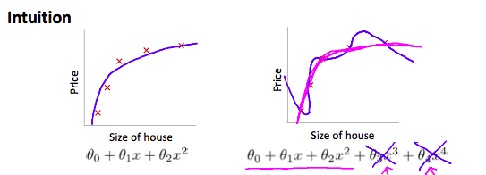

We could also regularize all of our theta parameters in a single summation as:

$$min_\theta \frac{1}{2m} \sum_{i=1}^m(h_\theta(x^{(i)})-y^{(i)})^2+\lambda\sum_{j=1}^n\theta_j^2$$

The λ, or lambda, is the **regularization parameter**. It determines how much the costs of our theta parameters are inflated. Using the above cost function with the extra summation, we can smooth the output of our hypothesis function to reduce overfitting. If lambda is chosen to be too large, it may smooth out the function too much and cause underfitting. Hence, what would happen if $\lambda = 0$ or is too small ?

## Regularized Linear Regression
We can apply regularization to both linear regression and logistic regression. We will approach linear regression first.
### Gradient Descent
We will modify our gradient descent function to separate out $\theta_0$ from the rest of the parameters because we do not want to penalize $\theta_0$.

*Repeat* {
$$\theta_0:=\theta_0-\alpha\frac{1}{m}\sum_{i=1}^m(h_\theta(x^{(i)})-y^{(i)})x_0^{(i)}$$
$$\theta_j:=\theta_j-\alpha\bigg[\bigg(\frac{1}{m}\sum_{i=1}^m(h_\theta(x^{(i)})-y^{(i)})x_j^{(i)}\biggr)+\frac{\lambda}{m}\theta_j\biggr] \text{ j ∈ {1,2...n}}$$
}

The term $\frac{\lambda}{m}\theta_j$ performs our regolarization.  With some manipulation our update rule can also be represented as:
$$θ_j:=θ_j(1−α\frac{\lambda}{m})−α\frac{1}{m}∑_{i=1}^m(h_θ
(x^{(i)})−y^{(i)})x_j^{(i)}$$
The first term in the above equation, $1 - \alpha\frac{\lambda}{m}$ will always be less than 1. Intuitively you can see it as reducing the value of $\theta_j$ by some amount on every update. *Notice* that the second term is now exactly the same as it was before.

### Normal Equation
Now let's approach regularization using the alternate method of the non-iterative normal equation.

To add in regularization, the equation is the same as our original, except that we add another term inside the parentheses:
$$θ=(X^TX+λ⋅L)^{−1}X^Ty$$
where $L = \begin{pmatrix} 0 & & & &  \\  & 1 \\ & & 1 \\ & & &  ... \\ & & & & 1\end{pmatrix}$

$L$ is a matrix with $0$ at the top left and $1$'s down the diagonal, with $0$'s everywhere else. It should have dimension $(n+1)×(n+1)$. Intuitively, this is the identity matrix (though we are not including $x_0$), multiplied with a single real number $λ$. Recall that if $m < n$, then $X^TX$ is non-invertible. However, when we add the term $λ⋅L$, then $X^TX + λ⋅L$ becomes invertible.

## Regularized Logistic Regression
We can regularize logistic regression in a similar way that we regularize linear regression. As a result, we can avoid overfitting. The following image shows how the regularized function, displayed by the pink line, is less likely to overfit than the non-regularized function represented by the blue line:

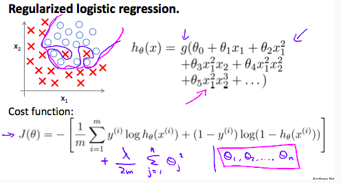

### Cost Function
We can regularize the cost function equation by adding a term to the end:
$$J(θ)=−\frac{1}{m}∑_{i=1}^m\bigg[y^{(i)}log(h_θ(x^{(i)}))+(1−y^{(i)}) log(1−h_θ(x^{(i)}))]+\frac{\lambda}{2m}∑_{j=1}^nθ_j^2$$

The second sum, $\sum_{j=1}^n \theta_j^2$ means to explicitly exclude the bias term, $\theta_0$. I.e. the $θ$ vector is indexed from $0$ to $n$ (holding $n+1$ values, $\theta_0$ through $\theta_n$), and this sum explicitly skips $\theta_0$, by running from $1$ to $n$, skipping $0$. Thus, when computing the equation, we should continuously update the two following equations:

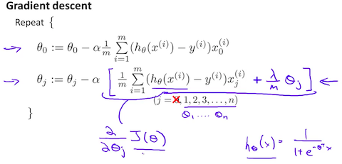

# Neural Networks

## Model Representation
Let's examine how we will represent a hypothesis function using neural networks. At a very simple level, neurons are basically computational units that take inputs (dendrites) as electrical inputs (called "spikes") that are channeled to outputs (axons). In our model, our dendrites are like the input features $x_1, ..., x_n$, and the output is the result of our hypothesis function. In this model our $x_0$ input node is sometimes called the *"bias unit."* It is always equal to 1. In neural networks, we use the same logistic function as in classification, $\frac{1}{1+e^{-\theta^Tx}}$ yet we sometimes call it a sigmoid (logistic) **activation function**. In this situation, our "theta" parameters are sometimes called "weights". 

Our input nodes (layer 1), also known as the "**input layer**", go into another node (layer 2), which finally outputs the hypothesis function, known as the "**output layer**". We can have intermediate layers of nodes between the input and output layers called the "**hidden layers**."

In this example, we label these intermediate or "hidden" layer nodes $a_0^2 ... a_n^2$ and call them "activation units". 
$$a_i^{(j)} = \text{ activation of unit i in layer j }$$
$$\Theta^{(j)}=\text{ matrix of parameters controlling function mapping from layer j to layer j+1}$$
The values for each of the "activation" nodes is obtained as follows:

$$a^{(2)}_1=g(Θ^{(1)}_{10}x_0+Θ^{(1)}_{11}x_1+Θ^{(1)}_{12}x_2+Θ^{(1)}_{13}x_3)$$
$$a^{(2)}_2=g(Θ^{(1)}_{20}x_0+Θ^{(1)}_{21}x_1+Θ^{(1)}_{22}x_2+Θ^{(1)}_{23}x_3)$$
$$a^{(2)}_3=g(Θ^{(1)}_{30}x_0+Θ^{(1)}_{31}x_1+Θ^{(1)}_{32}x_2+Θ^{(1)}_{33}x_3)$$
$$h_Θ(x)=a^{(3)}_1=g(Θ^{(2)}_{10}a^{(2)}_0+Θ^{(2)}_{11}a^{(2)}_1+Θ^{(2)}_{12}a^{(2)}_2+Θ^{(2)}_{13}a^{(2)}_3)$$

This is saying that we compute our activation nodes by using a $3×4$ matrix of parameters. We apply each row of the parameters to our inputs to obtain the value for one activation node. Our hypothesis output is the logistic function applied to the sum of the values of our activation nodes, which have been multiplied by yet another parameter matrix $\Theta^{(2)}$ containing the weights for our second layer of nodes.

Each layer gets its own matrix of weights, $\Theta^{(j)}$.

The dimensions of these matrices of weights is determined as follows:

$$\text{If network has $s_j$ units in layer $j$ and $s_{j+1}$ units in layer $j+1$, then $\Theta^{(j)}$ will be of dimension $s_{j+1} \times (s_j + 1)$.}$$

The +1 comes from the addition in $\Theta^{(j)}$ of the "bias nodes," $x_0$ and $\Theta_0^{(j)}$. In other words the output nodes will not include the bias nodes while the inputs will. The following image summarizes our model representation:

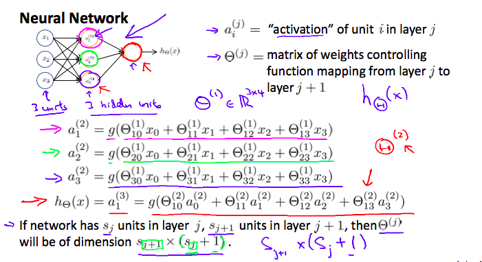

To re-iterate, the following is an example of a neural network:

$$a_1^{(2)} = g(\Theta_{10}^{(1)}x_0 + \Theta_{11}^{(1)}x_1 + \Theta_{12}^{(1)}x_2 + \Theta_{13}^{(1)}x_3) \newline a_2^{(2)} = g(\Theta_{20}^{(1)}x_0 + \Theta_{21}^{(1)}x_1 + \Theta_{22}^{(1)}x_2 + \Theta_{23}^{(1)}x_3) \newline a_3^{(2)} = g(\Theta_{30}^{(1)}x_0 + \Theta_{31}^{(1)}x_1 + \Theta_{32}^{(1)}x_2 + \Theta_{33}^{(1)}x_3) \newline h_\Theta(x) = a_1^{(3)} = g(\Theta_{10}^{(2)}a_0^{(2)} + \Theta_{11}^{(2)}a_1^{(2)} + \Theta_{12}^{(2)}a_2^{(2)} + \Theta_{13}^{(2)}a_3^{(2)}) \newline$$

In this section we'll do a vectorized implementation of the above functions. We're going to define a new variable $z_k^{(j)}$ that encompasses the parameters inside our g function. In our previous example if we replaced by the variable z for all the parameters we would get:

$$a_1^{(2)} = g(z_1^{(2)}) \newline a_2^{(2)} = g(z_2^{(2)}) \newline a_3^{(2)} = g(z_3^{(2)}) \newline $$
In other words, for layer $j=2$ and node $k$, the variable $z$ will be:
$$z_k^{(2)}=Θ_{k,0}^{(1)}x_0+Θ_{k,1}^{(1)}x_1+...+Θ_{k,n}^{(1)}x_n$$

Setting $x = a^{(1)}$, we can rewrite the equation as:
$$z^{(j)}=Θ^{(j−1)}a^{(j−1)}$$
We are multiplying our matrix $\Theta^{(j-1)}$ with dimensions $s_j\times (n+1)$ (where $s_j$ is the number of our activation nodes) by our vector $a^{(j-1)}$ with height $(n+1)$. This gives us our vector $z^{(j)}$ with height $s_j$. Now we can get a vector of our activation nodes for layer j as follows:
$$a^{(j)}=g(z^{(j)})$$
Where our function $g$ can be applied element-wise to our vector $z^{(j)}$.

We get this final $z$ vector by multiplying the next theta matrix after $\Theta^{(j-1)}$ with the values of all the activation nodes we just got. This last theta matrix $\Theta^{(j)}$ will have **only one row** which is multiplied by one column $a^{(j)}$ so that our result is a single number. We then get our final result with: $h_\Theta(x) = a^{(j+1)} = g(z^{(j+1)})$. Notice that in this **last step**, between layer j and layer j+1, **we are doing exactly the same thing** as we did in logistic regression. Adding all these intermediate layers in neural networks allows us to more elegantly produce interesting and more complex non-linear hypotheses.

## Examples
A simple example of applying neural networks is by predicting $x_1$ AND $x_2$, which is the logical 'and' operator and is only true if both $x_1$ and $x_2$ are 1.
Remember that $x_0$ is our bias variable and is always 1.

Let's set our first theta matrix as:
$$Θ^{(1)}=\begin{matrix}[  −30 & 20 & 20 \end{matrix}]$$
This will cause the output of our hypothesis to only be positive if both $x_1$ and $x_2$ are 1. In other words:

$$h_\Theta(x) = g(-30 + 20x_1 + 20x_2)\newline\newline x_1 = 0 \ \ and \ \ x_2 = 0 \ \ then \ \ g(-30) \approx 0 \newline x_1 = 0 \ \ and \ \ x_2 = 1 \ \ then \ \ g(-10) \approx 0 \newline x_1 = 1 \ \ and \ \ x_2 = 0 \ \ then \ \ g(-10) \approx 0 \newline x_1 = 1 \ \ and \ \ x_2 = 1 \ \ then \ \ g(10) \approx 1$$ 
So we have constructed one of the fundamental operations in computers by using a small neural network rather than using an actual AND gate. Neural networks can also be used to simulate all the other logical gates. The following is an example of the logical operator 'OR', meaning either $x_1$x is true or $x_2$ is true, or both:

### OR Operator
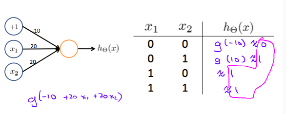

Where $g(z)$ is the following:

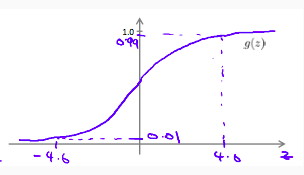

## Multiclass Classification
To classify data into multiple classes, we let our hypothesis function return a vector of values. Say we wanted to classify our data into one of four categories. We will use the following example to see how this classification is done. This algorithm takes as input an image and classifies it accordingly:

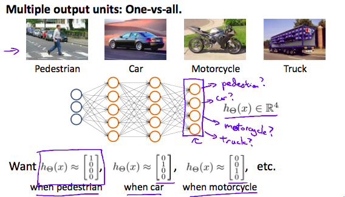

We can define our set of resulting classes as y:

$$y^{(i)}=\begin{bmatrix}1 \\ 0 \\ 0 \\0 \end{bmatrix},\begin{bmatrix}0 \\ 1 \\ 0 \\0 \end{bmatrix},\begin{bmatrix}0 \\ 0 \\ 1 \\0 \end{bmatrix},\begin{bmatrix}0 \\ 0 \\ 0 \\1 \end{bmatrix},$$

Each $y^{(i)}$ represents a different image corresponding to either a car, pedestrian, truck, or motorcycle. The inner layers, each provide us with some new information which leads to our final hypothesis function. The setup looks like:

$$\begin{bmatrix}x_0 \\ x_1 \\ x_2 \\ ... \\ x_n \end{bmatrix},\begin{bmatrix} a_0^{(2)} \\ a_1^{(2)} \\ a_2^{(2)} \\ ... \end{bmatrix},\begin{bmatrix} a_0^{(3)} \\ a_1^{(3)} \\ a_2^{(3)} \\ ... \end{bmatrix}, \rightarrow ... \rightarrow \begin{bmatrix} h_\Theta(x)_1 \\ h_\Theta(x)_2 \\ h_\Theta(x)_3 \\ h_\Theta(x)_4 \end{bmatrix}$$

Our resulting hypothesis for one set of inputs may look like:

$$h_\Theta(x)=\begin{bmatrix} 0 \\ 0 \\ 1 \\ 0\end{bmatrix}$$

In which case our resulting class is the third one down, or $h_Theta(x)_3$, which represents the motorcycle.